# TradeMaxxer — Architecture & Flow Diagrams

Visual reference for every system flow, optimization decision, and data path. All diagrams are Mermaid — render them on GitHub, VS Code, or any Markdown viewer.

---

## 1. System Overview

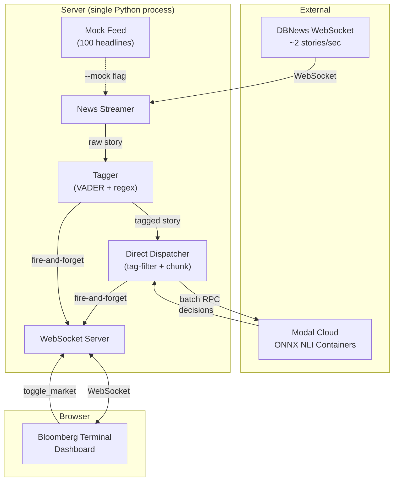

---

## 2. Latency Evolution — Before & After

### v1-v3: Groq LLM Era (~300-660ms)

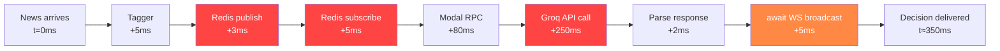

### v5 (Modal ONNX): Direct Dispatch (~143ms local, ~85ms VPS)

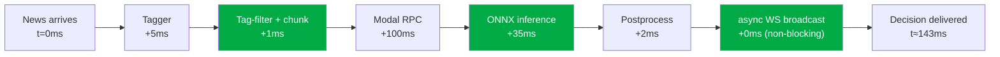

### v6 (current): Local ONNX — 16–69ms

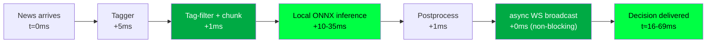

### What we cut

```mermaid
graph TD
    subgraph KILLED["Eliminated from hot path"]
        R1["Redis publish<br/>-3ms"]
        R2["Redis subscribe<br/>-5ms"]
        GR["Groq API call<br/>-250ms"]
        BL["Blocking WS await<br/>-5ms"]
        MR["Modal RPC overhead<br/>-100-260ms"]
    end

    subgraph OPTIMIZED["Optimized"]
        PT["PyTorch → ONNX<br/>40ms → 16ms"]
        BA["1-per-market RPC → batched<br/>N calls → ceil(N/50) calls"]
        LC["Cloud → local inference<br/>143ms → 16-69ms"]
    end

    style KILLED fill:#1a0000,stroke:#ff4444
    style OPTIMIZED fill:#001a00,stroke:#00cc44
```

---

## 3. Hot Path — News to Decision (Current)

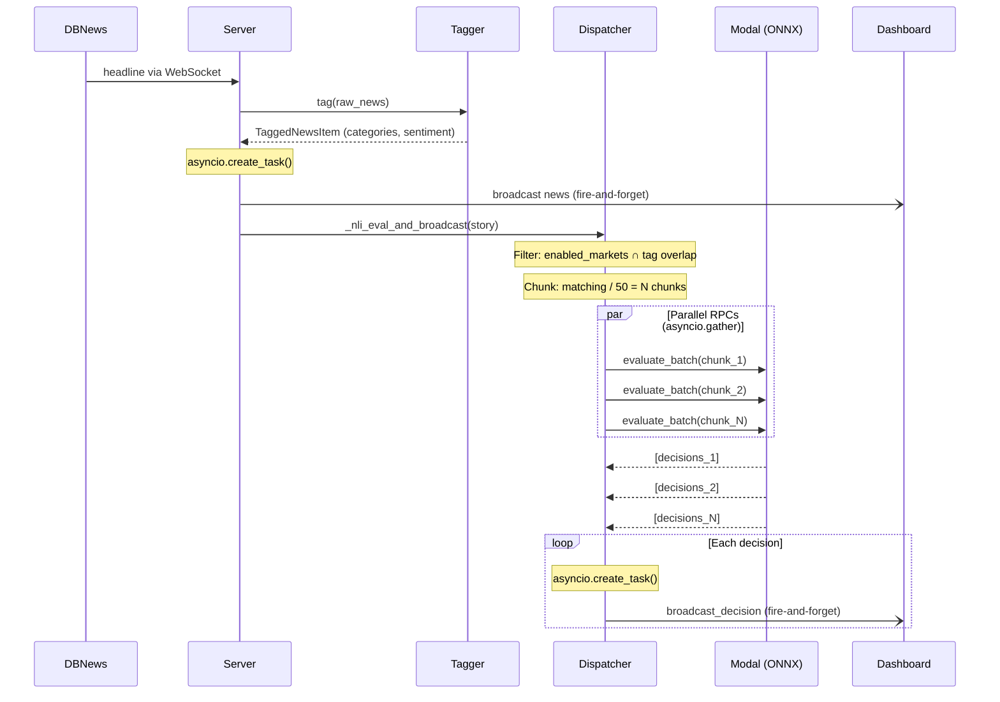

---

## 4. ONNX Inference Pipeline (inside Modal container)

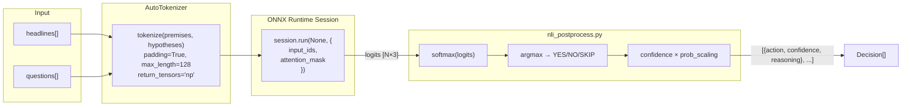

---

## 5. Confidence Scaling (Probability-Aware)

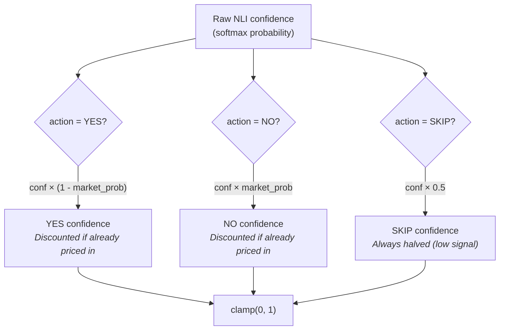

Example: headline says "Fed WILL cut rates" for a market at 95% YES probability.
NLI says YES with 0.9 raw confidence → scaled: `0.9 × (1 - 0.95) = 0.045`. Already priced in — don't trade.

---

## 6. Chunked Parallel Batching (Scaling to 5k+ Markets)

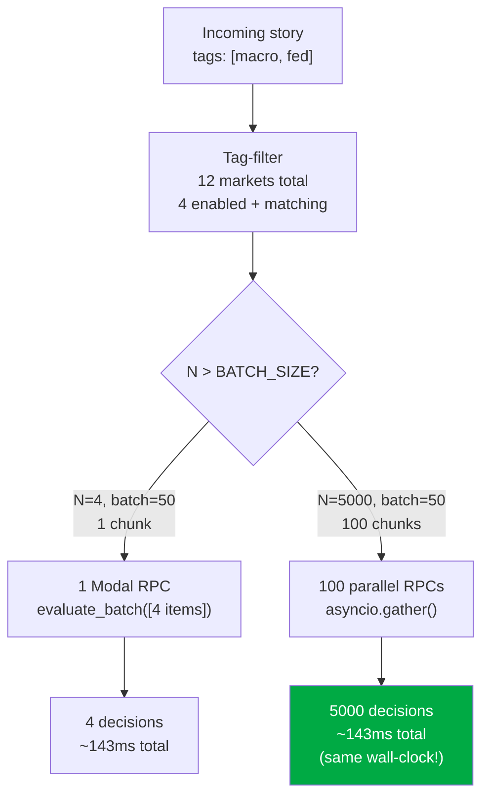

The key insight: **wall-clock time is constant regardless of market count**. Modal auto-scales containers. 1 batch or 100 batches in parallel — same latency from the caller's perspective.

---

## 7. Modal Container Lifecycle

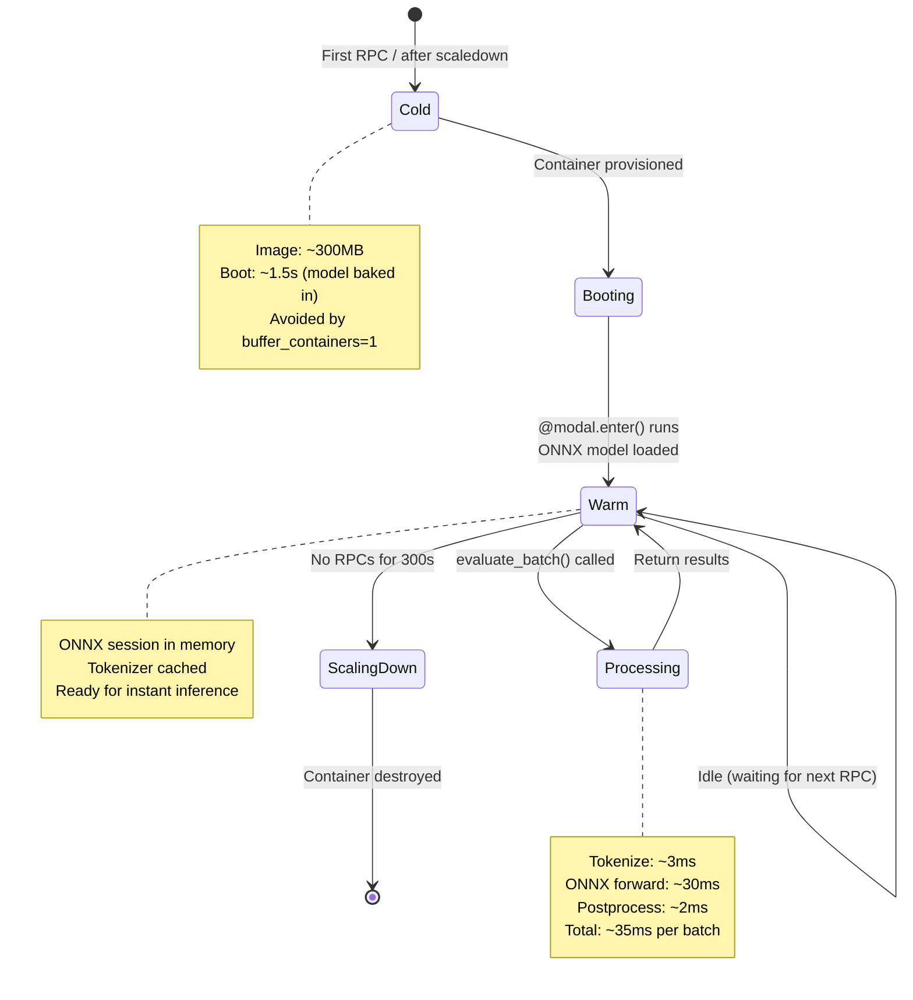

---

## 8. Dynamic Market Toggle Flow

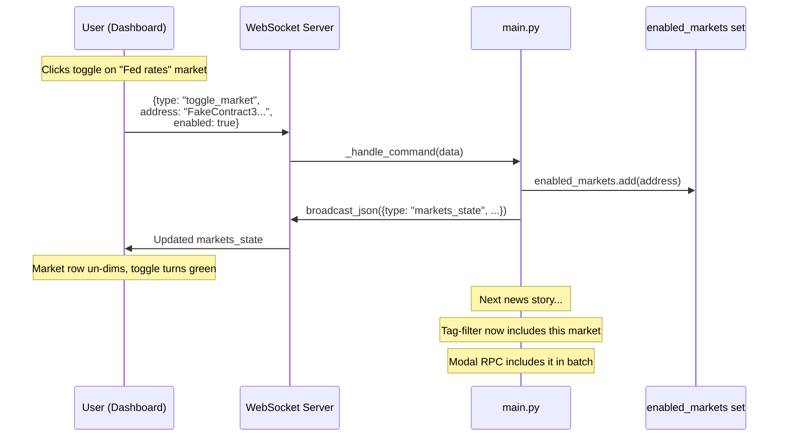

---

## 9. Data Flow — Types & Serialization

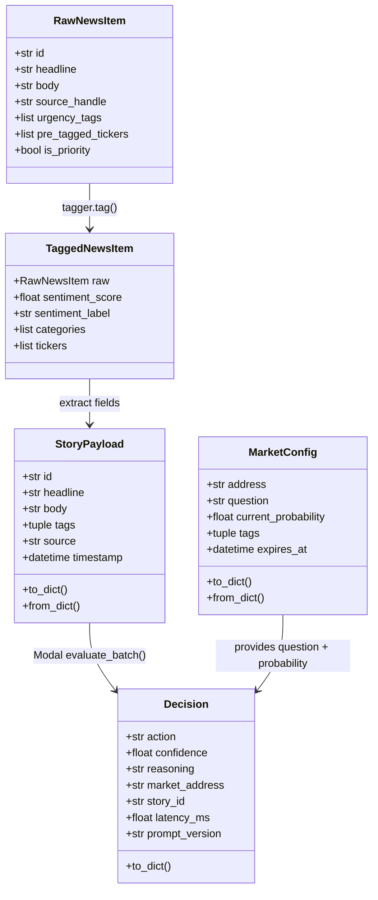

---

## 10. Architecture Evolution Timeline

```mermaid
graph LR
    V1["v1 Llama-70B<br/>658ms"] --> V3["v3 Llama-8B<br/>300ms"]
    V3 --> REDIS["Redis + Mock<br/>Full pipeline"]
    REDIS --> DASH["Bloomberg UI<br/>13 panels"]
    DASH --> PT["DeBERTa PyTorch<br/>200ms"]
    PT --> OX["ONNX on Modal<br/>143ms"]
    OX --> DD["Direct dispatch<br/>Batching + toggles"]
    DD --> LO["Local ONNX<br/>16-69ms"]

    style V1 fill:#1a0000,stroke:#ff4444,color:#fff
    style V3 fill:#1a0000,stroke:#ff4444,color:#fff
    style PT fill:#0a0a1a,stroke:#4488ff,color:#fff
    style OX fill:#0a0a1a,stroke:#4488ff,color:#fff
    style DD fill:#001a00,stroke:#00cc44,color:#fff
    style LO fill:#00aa44,color:#fff
```

---

## 11. Deployment Topology

```mermaid
graph TB
    subgraph LOCAL["Dev Machine (Mac)"]
        DEV["Python server<br/>+ Vite dev server"]
    end

    subgraph PROD["Production (planned)"]
        subgraph VPS["VPS — US-East ($5/mo)"]
            SRV["Python server"]
            REDIS["Redis"]
        end

        subgraph MODAL_CLOUD["Modal Cloud"]
            MC1["Container 1<br/>(buffer — always warm)"]
            MC2["Container 2<br/>(auto-scaled)"]
            MC3["Container N<br/>(auto-scaled)"]
        end

        subgraph VERCEL["Vercel (free)"]
            FE["React Dashboard"]
        end
    end

    DEV -->|"~100ms RPC<br/>(residential internet)"| MODAL_CLOUD
    VPS -->|"~30ms RPC<br/>(same AWS region)"| MODAL_CLOUD
    FE <-->|WebSocket| VPS
    SRV --> REDIS

    style DEV fill:#332200,stroke:#ff9800
    style VPS fill:#002200,stroke:#00cc44
    style MODAL_CLOUD fill:#000033,stroke:#4488ff
```

---

## 12. Why Each Optimization Matters

```mermaid
graph LR
    subgraph Before["Before: ~350ms"]
        direction TB
        B1["Groq API<br/>250ms"] ~~~ B2["Redis roundtrip<br/>8ms"]
        B2 ~~~ B3["Blocking WS<br/>5ms"]
        B3 ~~~ B4["Modal RPC<br/>80ms"]
        B4 ~~~ B5["PyTorch<br/>40ms"]
    end

    subgraph After["After: 16–69ms (local ONNX)"]
        direction TB
        A1["ONNX Runtime<br/>10-35ms"] ~~~ A2["Direct dispatch<br/>1ms"]
        A2 ~~~ A3["Fire-and-forget WS<br/>0ms"]
        A3 ~~~ A4["No network<br/>0ms"]
    end

    Before -->|"5–22x faster"| After

    style Before fill:#1a0000,stroke:#ff4444
    style After fill:#001a00,stroke:#00cc44
```

---

## 13. Inference Modes — Local vs Modal vs Modal-Hosted

```mermaid
graph TD
    subgraph LOCAL["--local (current best: 16-69ms)"]
        L1["News → Tagger → ONNX (in-process) → Decision"]
        L2["Zero network. All on your machine."]
    end

    subgraph MODAL_RPC["default (Modal RPC: ~143ms Mac / ~85ms VPS)"]
        M1["News → Tagger → Modal RPC → ONNX (cloud) → Decision"]
        M2["Scales to 5k+ markets via parallel RPCs."]
    end

    subgraph MODAL_HOSTED["future (Modal-hosted: ~40ms est.)"]
        F1["News + Tagger + ONNX all on Modal"]
        F2["Zero RPC. Mac just shows dashboard."]
    end

    style LOCAL fill:#001a00,stroke:#00ff44
    style MODAL_RPC fill:#0a0a1a,stroke:#4488ff
    style MODAL_HOSTED fill:#1a1a00,stroke:#ffcc00
```

| Mode | Command | E2E Latency | Scaling | Cost |
|------|---------|-------------|---------|------|
| **Local ONNX** | `--local` | **16–69ms** | Single machine | $0 |
| Modal RPC | (default) | 85–200ms | 5k+ markets | ~$0.001/story |
| Modal-hosted | (planned) | ~40ms est. | 5k+ markets | ~$0.001/story |
